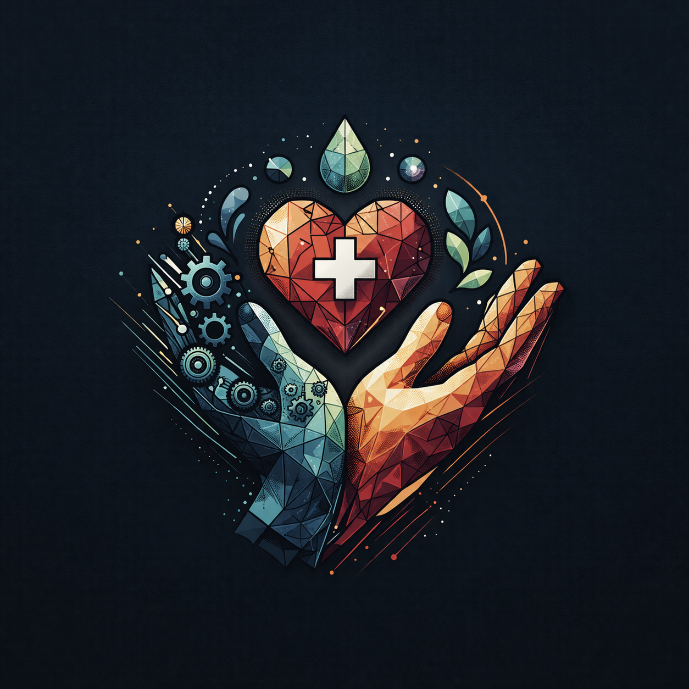

<!DOCTYPE html>
<html lang="en">
<head>
  <meta charset="UTF-8">
  <meta name="viewport" content="width=device-width, initial-scale=1.0">
  <title>ACTOC | Advancing Children in Technology Orange County</title>
  <link rel="preconnect" href="https://fonts.googleapis.com">
  <link rel="preconnect" href="https://fonts.gstatic.com" crossorigin>
  <link href="https://fonts.googleapis.com/css2?family=Inter:wght@300;400;600;800;900&display=swap" rel="stylesheet">
  
</head>
<body>

<nav>
  
<strong style="font-size:28px;">ACTOC</strong> <small style="color:rgba(255,255,255,.6)">Advancing Children in Technology Orange County</small>

  

    <a href="#about">About</a>
    <a href="#programs">Programs</a>
    <a href="#impact">Impact</a>
    <a href="#founders">Founders</a>
    <a href="#partner" class="btn gold">Get Involved</a>
  

</nav>

<section class="hero">
  

    <h1>Every child deserves STEM, robotics, and wellness for free.</h1>
    
Two high school students built ACTOC because too many children never get access to the opportunities that shape confidence, health, and future careers.

    <a href="#programs" class="btn white">See Our Programs</a>
    <a href="#partner" class="btn outline">Partner With Us</a>
    

      
<h3 style="color:#e7c07d;font-size:34px;">$0</h3>Cost to families

      
<h3 style="color:#8fc7d6;font-size:34px;">2</h3>Programs

      
<h3 style="color:#c96a5a;font-size:34px;">∞</h3>Potential

    

  

  

</section>

<section id="about" class="section white-section">
  <h2>Kids do not miss out for one reason. They miss out because every barrier shows up at once.</h2>
  

    
<h3>The STEM Access Gap</h3> 
School budgets cannot sustain STEM programs. Families cannot afford robotics fees and materials. Many students never get early exposure.

    
<h3>The Wellness Education Gap</h3> 
Nutrition, body literacy, and mental health education are often deprioritized, leaving children without child-friendly wellness resources.

  

</section>

<section id="programs" class="section white-section" style="border-radius:0;">
  <h2>Two Programs. One Mission.</h2>
  

    
<h3>ACTOC Robotics</h3> 
Free hands-on STEM and robotics workshops for elementary students. No materials cost. No school budget required. We bring everything.

    
<h3>ACTOC Wellness Series</h3> 
A three-book wellness series on Nutrition, Body Health, and Mental Health with free presentations at schools and libraries.

  

</section>

<section id="impact" class="section impact">
  <h2>Our 2026 Goals</h2>
  

    
Launch Workshops

    
Publish 3 Wellness Books

    
Start Chapters

    
International Outreach

    
Increase Volunteers

  

</section>

<section id="founders" class="section white-section" style="border-radius:0;">
  <h2>Built by students. For every student.</h2>
  

    
<h3>Nitika Metharamitta</h3> 
<b>Co-Founder & President</b>  Focused on creating equal access to STEM education and helping students discover innovation pathways early.

    
<h3>Amulya Atluri</h3> 
<b>Co-Founder & Vice President</b>  Dedicated to child wellness education and building stronger health literacy for young learners.

  

</section>

<section id="partner" class="section" style="background:#e7c07d;color:black;text-align:center;">
  <h2 style="color:black;">Help us build access that actually reaches every child.</h2>
  
Partner, volunteer, donate materials, or host ACTOC at your school, library, or organization.

  

    <input placeholder="Name">
    <input placeholder="Email">
    <textarea rows="4" placeholder="Message"></textarea>
    <a href="#" class="btn gold">Send Message</a>
  

</section>

<footer>
  
ACTOC • Advancing Children in Technology Orange County

  
Student-led 501(c)(3) nonprofit organization • info@actoc.org

</footer>

</body>
</html>
